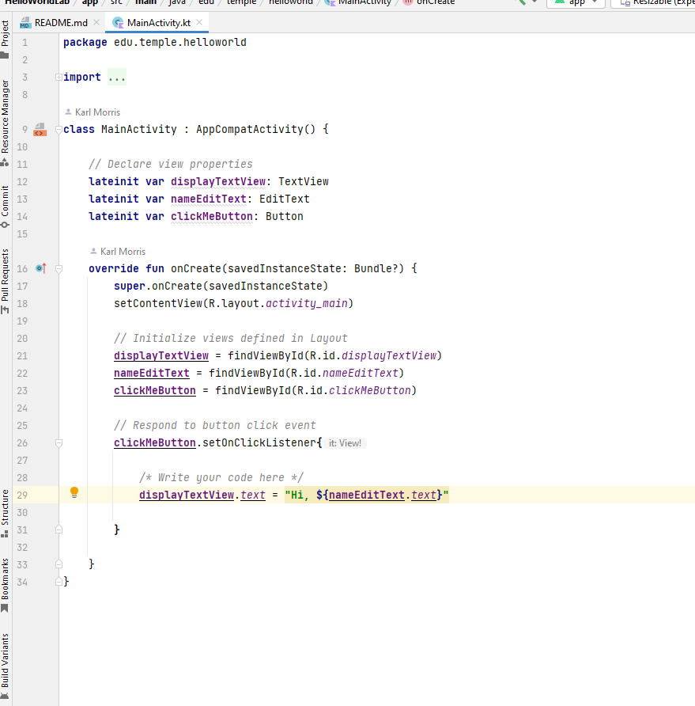
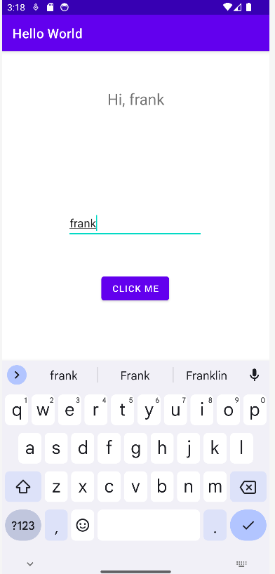

# Hello Wrold Lab

## Description

This is a simple Android app that provides the following functionality:

- Greet the user with a personalized message.
- Allows the user to enter their name.
- Displays a greeting message when a button is clicked.

## Screenshots
This is what the code looks like:

This is the running app looks like:

## Features

- **Greeting Message**: The app displays a greeting message with the user's name when the button is clicked.

